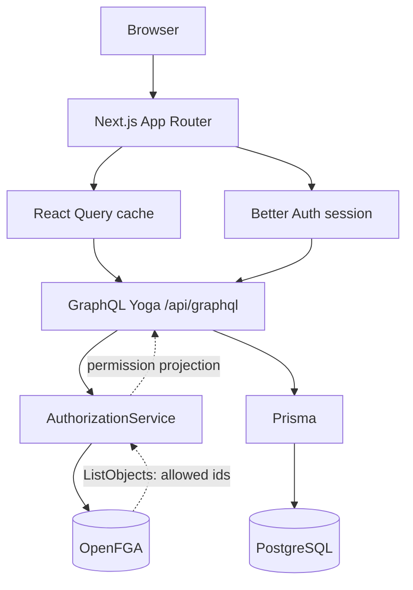
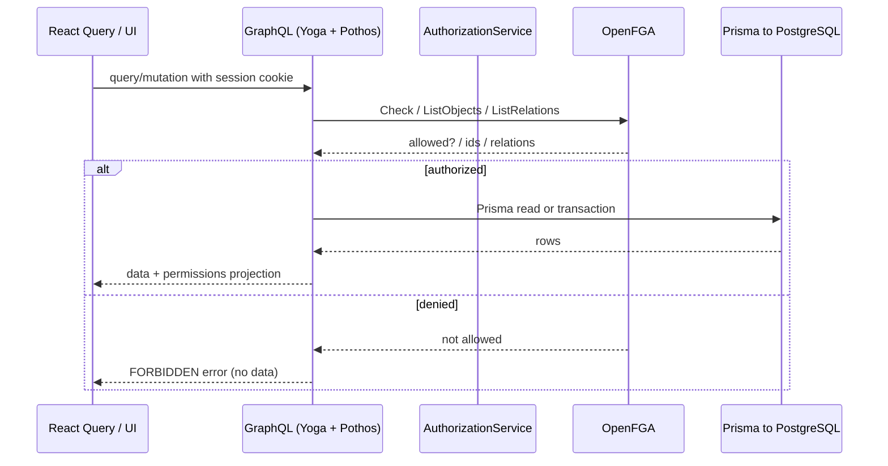
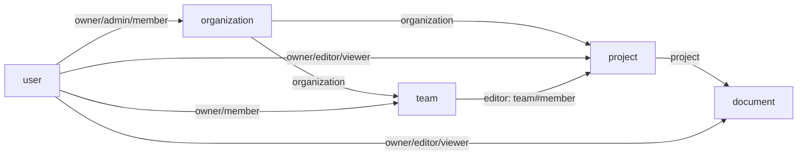
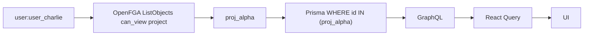
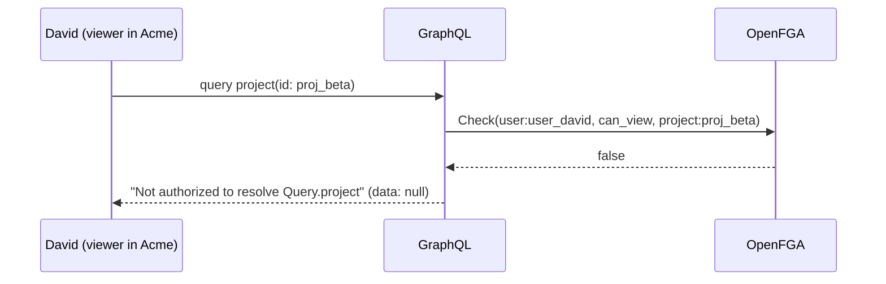
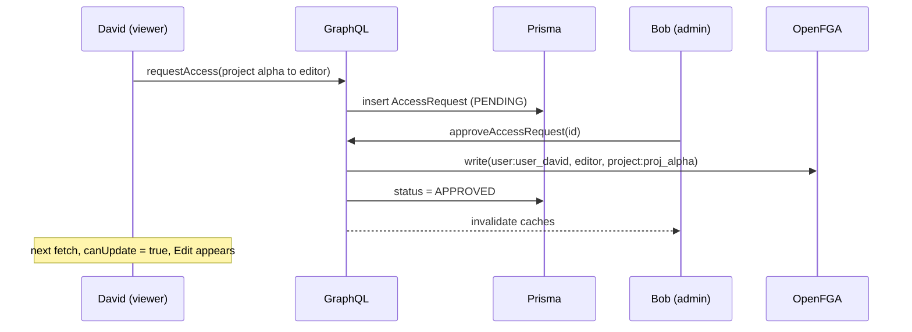
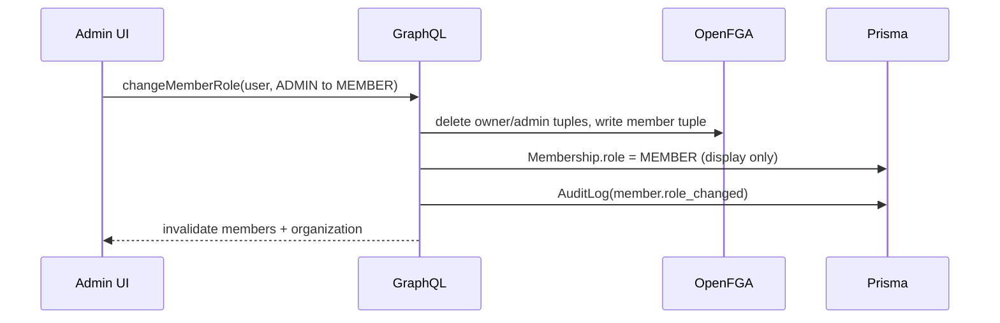
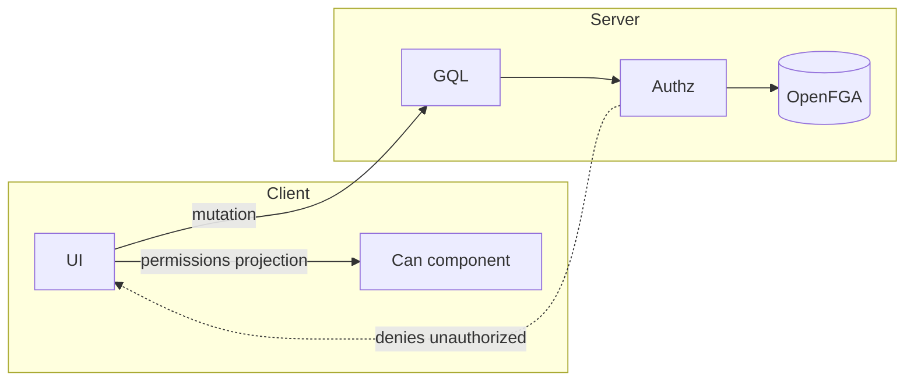

# FGAC Reference Application

A small but realistic multi-tenant SaaS ("Acme Inc.") showing **fine-grained access control** where
**OpenFGA is the single source of authorization truth** and the frontend **projects itself** from the
user's permissions.

The same application looks and behaves differently for an Owner, an Admin, a Project Editor, and a
Project Viewer: different navigation, different routes, different pages, different actions, and —
crucially — different **data** (unauthorized resources and fields never leave the server).

> Built inside a Next.js App Router + shadcn/ui Turborepo. Authentication (Better Auth), data
> (Prisma/PostgreSQL), and authorization (OpenFGA) are kept strictly separate.

---

## Table of contents

1. [What this demonstrates](#what-this-demonstrates)
2. [Quick start](#quick-start)
3. [Demo accounts & the permission matrix](#demo-accounts--the-permission-matrix)
4. [Architecture](#architecture)
5. [Authentication vs authorization](#authentication-vs-authorization)
6. [RBAC vs FGAC](#rbac-vs-fgac)
7. [Why OpenFGA](#why-openfga)
8. [The authorization model](#the-authorization-model)
9. [Relationship tuples](#relationship-tuples)
10. [Row-level authorization (ListObjects)](#row-level-authorization-listobjects)
11. [Navigation-level authorization](#navigation-level-authorization)
12. [Route-level authorization](#route-level-authorization)
13. [Page-level authorization](#page-level-authorization)
14. [Component & action-level authorization](#component--action-level-authorization)
15. [Table-level authorization](#table-level-authorization)
16. [Field / projection-level authorization](#field--projection-level-authorization)
17. [GraphQL authorization](#graphql-authorization)
18. [Prisma responsibilities](#prisma-responsibilities)
19. [React Query responsibilities](#react-query-responsibilities)
20. [Permission caching & invalidation](#permission-caching--invalidation)
21. [Avoiding N+1 OpenFGA checks](#avoiding-n1-openfga-checks)
22. [IDOR prevention](#idor-prevention)
23. [Access request workflow](#access-request-workflow)
24. [Role management workflow](#role-management-workflow)
25. [How to add a new permission](#how-to-add-a-new-permission)
26. [How to add a new resource](#how-to-add-a-new-resource)
27. [Frontend vs backend authorization](#frontend-vs-backend-authorization)
28. [Hide vs disable: a deliberate UX decision](#hide-vs-disable-a-deliberate-ux-decision)
29. [Directory map](#directory-map)
30. [Tests](#tests)
31. [Acceptance checklist](#acceptance-checklist)

---

## What this demonstrates

| Layer | Mechanism |
|---|---|
| Authentication | Better Auth — "who are you?" |
| Authorization | OpenFGA — "what may you do?" (source of truth) |
| Application data | Prisma + PostgreSQL — "what exists?" |
| Client projection | React Query + server-computed `permissions` objects — "what should the UI show?" |

Every protected operation flows `GraphQL → AuthorizationService → OpenFGA`. The frontend consumes a
server-computed permission projection; it never decides access itself.

---

## Quick start

```bash
# 1. Install
pnpm install

# 2. Start Postgres + OpenFGA
pnpm docker:up

# 3. Copy env (only needed once) and set up everything
cp .env.example .env
pnpm setup           # generate + push + seed + OpenFGA model/tuples

# 4. Run
pnpm dev             # http://localhost:3000
```

> `pnpm setup` expands to `db:generate → db:push → db:seed → fga:setup`. `fga:setup` creates the
> OpenFGA store + model + tuples and writes `FGA_STORE_ID` / `FGA_MODEL_ID` back into `.env`.
>
> Postgres is exposed on host port **5433** (container 5432) to avoid clashing with a local Postgres;
> OpenFGA runs on **8080** with a playground at **3001**.

Useful scripts:

| Script | Purpose |
|---|---|
| `pnpm docker:up` / `pnpm docker:down` | Start / stop Postgres + OpenFGA |
| `pnpm db:generate` / `db:push` / `db:migrate` / `db:seed` | Prisma |
| `pnpm fga:setup` / `pnpm fga:seed` | Write OpenFGA model / tuples |
| `pnpm dev` / `pnpm build` / `pnpm typecheck` / `pnpm lint` / `pnpm test` | App |

---

## Demo accounts & the permission matrix

Sign in at `/sign-in` (one-click demo switcher). Password for every account: `password1234`.

| | Nav | Project Alpha | Members | Billing | Audit |
|---|---|---|---|---|---|
| **Alice** — Owner | all 9 items | Edit · Delete · Share · Settings | manage roles | visible (₹4,82,000) | visible |
| **Bob** — Admin | all except Billing | Edit · Share (Delete only on Beta) | manage roles | **403** | visible |
| **Charlie** — Project Editor | Dashboard · Projects · Documents · Teams | Edit · Share (no Delete) | **403** | **403** | **403** |
| **David** — Project Viewer | Dashboard · Projects · Documents · Teams | read-only + *Request edit access* | **403** | **403** | **403** |
| **Eve** — Globex Owner | own tenant only | — | own tenant | own tenant | own tenant |

Relationships behind this matrix:

- Alice owns Acme; Bob is an Acme admin; Charlie and David are Acme members.
- Alpha: Alice owner, Charlie editor, **Platform team** editors, David viewer.
- Beta: Bob owner only. Gamma: Alice owner only. Globex projects belong to a different tenant.
- Documents inherit access from their project.

---

## Architecture



Request lifecycle for a protected read/write:



---

## Authentication vs authorization

- **Authentication** (`apps/web/lib/auth.ts`): Better Auth with the Prisma adapter. It creates the
  session and answers *who are you?* It never answers *what may you do?*.
- **Authorization** (`packages/authz`): OpenFGA. Given `user:<id>` and a resource, it decides access.
- **Session → subject**: the GraphQL context maps the session to an OpenFGA subject
  (`user:user_alice`). No session ⇒ `subject: null` ⇒ every protected field is denied.

---

## RBAC vs FGAC

RBAC answers "what role do you have?" and every feature must translate roles into permissions.
FGAC answers "what is your relationship to *this* resource?" — so a user can be an editor on one
project and a viewer on another, and the same UI adapts.

This codebase never checks a role:

```tsx
// never done anywhere in the app
if (role === "admin") { /* … */ }

// everywhere instead
<Can permission="organization.manage_members">{/* … */}</Can>
```

`Membership.role` exists **only to display a role label** in the members table; it is never consulted
for an access decision.

---

## Why OpenFGA

OpenFGA (an implementation of Google's Zanzibar) externalizes authorization as a **relationship
graph**. Compared with scattering conditionals through the app:

- **One source of truth** — the whole model lives in `packages/authz/authorization-model.fga`.
- **Inheritance for free** — org admin ⇒ project editor ⇒ document editor, expressed once.
- **Row-level filtering** — `ListObjects` returns the ids you can see, so you query
  `WHERE id IN (…)` instead of fetching everything and filtering in the client.
- **Auditable** — every decision is a tuple check you can replay in the OpenFGA playground.

---

## The authorization model



`packages/authz/authorization-model.fga` (compiled to JSON in `src/model.ts`, written by `fga:setup`):

```dsl
type organization
  relations
    define owner: [user]
    define admin: [user]
    define member: [user]
    define can_view: member or admin or owner
    define can_view_members: admin or owner
    define can_view_teams: member or admin or owner
    define can_view_projects: admin or owner
    define can_manage_organization: admin or owner
    define can_manage_members: admin or owner
    define can_manage_teams: admin or owner
    define can_view_audit_logs: admin or owner
    define can_manage_billing: owner
    define can_create_project: admin or owner
    define can_edit_project: admin or owner
    define can_delete_project: owner

type project
  relations
    define organization: [organization]
    define owner: [user]
    define editor: [user, team#member]
    define viewer: [user, team#member]
    define can_view: viewer or editor or owner or can_view_projects from organization
    define can_edit: editor or owner or can_edit_project from organization
    define can_delete: owner or can_delete_project from organization
    define can_share: editor or owner
    define can_create_document: editor or owner
    define can_manage_project: owner or can_manage_organization from organization

type document
  relations
    define project: [project]
    define can_view: viewer or editor or owner or can_view from project
    define can_edit: editor or owner or can_edit from project
    define can_delete: owner or can_delete from project
    define can_share: editor or owner or can_share from project
```

Inheritance in action: `organization:acme#admin ⇒ project:beta#can_edit`, while
`organization:acme#owner ⇒ project:beta#can_delete`. The `can_view_projects` relation is why a plain
member sees **only** the projects they are related to, while admins/owners see all of them.

---

## Relationship tuples

Facts are tuples (`user`, `relation`, `object`); permissions are computed from them. A representative
slice (`packages/authz/src/tuples.ts`):

```
user:user_alice    owner    organization:org_acme
user:user_bob      admin    organization:org_acme
user:user_charlie  member   organization:org_acme

team:team_platform#member  editor  project:proj_alpha     # team-based grant
user:user_charlie          editor  project:proj_alpha
user:user_david            viewer  project:proj_alpha
user:user_bob              owner   project:proj_beta

project:proj_alpha  project  document:doc_architecture
```

Approving an access request **adds a tuple**; changing a role **rewrites a tuple** — that is the
whole "when permissions change" story.

---

## Row-level authorization (ListObjects)

Collections are filtered in the authorization layer *before* the database:



`projects(organizationId)` calls `accessibleIds(subject, "project.view")` (one `ListObjects`), then a
single Prisma query with `id: { in: ids }`. Unauthorized projects are never fetched, so the UI cannot
receive them.

---

## Navigation-level authorization

`apps/web/lib/nav.ts` defines the nav items, each with a required capability; `visibleNavItems()`
filters them from the server-provided projection. The sidebar renders only what is authorized — and
because the projection comes from the server layout, there is **no flicker**.

```tsx
const { canManageMembers, canManageBilling, canViewAuditLogs } = usePermissions()

<Sidebar>
  <NavItem href="/dashboard" />
  <NavItem href="/projects" />
  {canManageTeams && <NavItem href="/teams" />}
  {canManageMembers && <NavItem href="/members" />}
  {canManageBilling && <NavItem href="/billing" />}
  {canViewAuditLogs && <NavItem href="/audit-logs" />}
</Sidebar>
```

Checks are **capability-based** (`canManageMembers`), never `role === "admin"`.

---

## Route-level authorization

Hiding a nav item is not security. Gated server pages call `requireCapability()` (which calls
`forbidden()` from `next/navigation`), so typing the URL directly still yields a 403:

```tsx
// app/(app)/billing/page.tsx
export default async function BillingPage() {
  await requireCapability("canManageBilling")   // member → forbidden() → app/forbidden.tsx
  return <BillingView />
}
```

`app/forbidden.tsx` renders the 403 boundary (enabled via `experimental.authInterrupts`).
Project pages additionally check `project.view` for the specific id, so `/projects/<someone-elses-id>`
is a 403 (see [IDOR](#idor-prevention)).

`proxy.ts` (Next 16's middleware) only performs an **optimistic** cookie check to redirect
unauthenticated users to `/sign-in`. It is never the authorization boundary.

---

## Page-level authorization

`projects/[projectId]/page.tsx` renders different actions per permission projection:

| Viewer | Editor | Owner |
|---|---|---|
| — | Edit · Share | Edit · Share · **Delete** · Project settings |
| read-only documents | + New document | + New document · **Delete** |

```tsx
<Can permission="project.update" on={project.permissions}>
  <EditButton />
</Can>

<PermissionButton permission="project.delete" on={project.permissions}
  disabledReason="You don't have permission to delete this project.">
  Delete
</PermissionButton>
```

---

## Component & action-level authorization

One component, used consistently: **`<Can permission="…">`**.

```tsx
<Can permission="organization.manage_members">
  <InviteMemberButton />
</Can>

<DropdownMenuContent>
  <DropdownMenuItem>View</DropdownMenuItem>
  <Can permission="project.update" on={project.permissions}>
    <DropdownMenuItem>Edit</DropdownMenuItem>
  </Can>
  <Can permission="project.delete" on={project.permissions}>
    <DropdownMenuItem>Delete</DropdownMenuItem>
  </Can>
</DropdownMenuContent>
```

`useCan(permission, on?)` powers both `Can` and `PermissionButton`. When `on` is omitted it reads the
organization capability from context; when provided it reads a resource's `permissions` projection
(no extra request).

---

## Table-level authorization

The Members table conditionally renders management controls:

```tsx
<TableHeader>
  <TableHead>Member</TableHead>
  <TableHead>Role</TableHead>
  <Can permission="organization.manage_members">
    <TableHead>Actions</TableHead>
  </Can>
</TableHeader>
```

Owner/Admin see the Actions column (change role / remove); a regular member never receives it.

---

## Field / projection-level authorization

Sensitive fields are gated in the GraphQL schema with Pothos auth scopes, so they resolve to `null`
(and an error) rather than being sent and hidden with CSS:

```ts
billingEmail: t.exposeString("billingEmail", {
  nullable: true,
  authScopes: (org) => requirePerm("organization.manage_billing", org.id),
}),
```

Querying `organization.billingEmail` as a member returns `billingEmail: null` + an authorization
error. The dashboard similarly returns `null` for `members`, `auditEvents`, and `monthlyRevenue` when
the viewer lacks the corresponding capability, and the UI simply does not render those metrics.

---

## GraphQL authorization

`apps/web/lib/graphql/builder.ts` installs `@pothos/plugin-scope-auth` with a `perm` scope loader
backed by the same catalog:

```ts
authScopes: async (context) => ({
  loggedIn: !!context.subject,
  perm: ({ permission, resourceId }) =>
    context.subject ? check(context.subject, permission, resourceId) : false,
})
```

- **Queries/mutations** declare `authScopes` (often derived from args or parent).
- **Fields on types** declare scopes that depend on the parent (`(org) => requirePerm(…, org.id)`).
- A denied field never runs its resolver, so **no Prisma query is issued** for unauthorized data.

---

## Prisma responsibilities

Prisma is *only* the data layer: entities, relations, and the audit log. It contains **no
authorization logic**. `Membership.role` is a display projection kept in sync on writes. Resource
access is not modeled in tables at all — it lives entirely in OpenFGA.

---

## React Query responsibilities

`apps/web/hooks/*` wrap `graphql-request` in `useQuery`/`useMutation`:

- Queries return data *plus* a `permissions` projection the UI consumes.
- Mutations invalidate the relevant keys on success.
- `useChangeMemberRole` demonstrates an **optimistic update with rollback**: the new role shows
  immediately, and is rolled back if the server (OpenFGA) denies it.

---

## Permission caching & invalidation

- **Server**: `getActiveOrgContext` is wrapped in React `cache()` so the session and capability
  projection are computed once per render pass. Pothos scope-auth caches scope loaders per request.
- **Client**: React Query caches projections (`staleTime: 30s`, `refetchOnWindowFocus`).
- **Invalidation**: mutations invalidate `["projects"]`, `["project", id]`, `["members"]`,
  `["organization", id]`, `["dashboard"]`, etc. Approving an access request invalidates the affected
  resource keys so the requester's UI reflects the new permission on next fetch.
- Cross-session propagation is eventual (a refetch/reload picks up tuple changes) — realistic for a
  Zanzibar-style system, and stated here explicitly.

---

## Avoiding N+1 OpenFGA checks

The app uses the right primitive for each shape:

| Need | Primitive | Calls |
|---|---|---|
| One resource's full permission set | `ListRelations` (via `projectPermissions`) | **1** for N permissions |
| "Which of these resources can I see?" | `ListObjects` (`listAccessibleIds`) | **1** for the whole collection |
| Many (resource, permission) pairs | `BatchCheck` (`batchCheck`) | **1** for all pairs |
| A single yes/no | `Check` | 1 |

`loadProjectPermissions` batches **every** (project × permission) check for a page into a single
`BatchCheck`, so rendering 50 projects is one round trip, not 300 `Check` calls. Looping `Check` over
a collection is never done.

---

## IDOR prevention

Changing an id in the URL or a GraphQL argument must not grant access:



The page route does the same check (`forbidden()`), and `deleteProject(id)` denies a viewer who sends
the mutation directly. The check always uses the **authenticated subject**, never a client-supplied
one.

---

## Access request workflow



Rejecting only changes the request status (no tuple). This shows frontend UX driven by FGAC state.

---

## Role management workflow



The change is checked by OpenFGA (`organization.manage_members`) **before** the mutation runs; the
`Membership.role` column is updated purely for display.

---

## How to add a new permission

1. Add the relation to `organization`/`project`/… in `authorization-model.fga` **and** `src/model.ts`.
2. Add a key to `PERMISSIONS` in `packages/authz/src/permissions.ts` mapping it to `{ resource, relation }`.
3. `pnpm fga:setup` to publish the model.
4. Gate the server side with `authScopes`/`requirePerm`. Gate the UI with
   `<Can permission="your.new_permission">`.
5. If it is an organization capability, add it to the projection (`ORG_FIELDS` in
   `lib/graphql/projections.ts`) and `OrganizationPermissions`.
6. Add a test to `packages/authz/src/__tests__/authorization.test.ts`.

## How to add a new resource

1. Add a type to `authorization-model.fga` (relations + `can_*` permissions) and `src/model.ts`.
2. Add its parent link relation (e.g. `organization`/`project`) and seed the tuple.
3. Add a Prisma model if it needs application data.
4. Add a Pothos object type with a `permissions` field resolved via `load*Permissions`.
5. Add hooks + a view; gate navigation and routes by capability.

---

## Frontend vs backend authorization

- **Backend** is the security boundary: GraphQL → `AuthorizationService` → OpenFGA. It is enforced on
  every query and mutation regardless of what the client sends.
- **Frontend** is a projection/UX layer: it uses the server-computed `permissions` to decide what to
  render. Hiding a button is not security — the same command re-checks on the server.



---

## Hide vs disable: a deliberate UX decision

- **Hide** sensitive/admin-only surfaces where discoverability is not useful: the Billing/Audit/Settings
  nav items, the Members management column, the create-project button for viewers, and Edit on a
  project you cannot edit.
- **Disable** actions where knowing the action exists is helpful: **Delete** on a project you can view
  but not delete stays visible, greyed out, with a tooltip
  *"You don't have permission to delete this project."* (`PermissionButton`).

Both are UX only; both are backed by a server-side check.

---

## Directory map

```
packages/authz/                 # OpenFGA-only: model, catalog, client, service, scripts, tests
  authorization-model.fga        # human-readable source of truth
  src/model.ts                   # same model as JSON (what gets written)
  src/permissions.ts             # the permission catalog (the only place permission strings live)
  src/tuples.ts                  # demo tuples
  src/service.ts                 # AuthorizationService: check / projection / listObjects / batchCheck / write
packages/db/                    # Prisma schema (auth + domain), client, seed
apps/web/
  proxy.ts                       # optimistic auth redirect (Next 16 middleware)
  app/api/auth/[...all]/route.ts # Better Auth handler
  app/api/graphql/route.ts       # GraphQL Yoga endpoint
  app/(app)/…                    # gated pages: dashboard, projects, documents, teams, members,
                                 # access-requests, settings, billing, audit-logs
  components/fgac/               # Can, PermissionButton, PermissionProvider, ForbiddenCard
  components/views/…             # page views
  hooks/…                        # React Query hooks
  lib/graphql/…                  # Pothos builder, scope auth, projections, schema
  lib/nav.ts                     # capability-driven navigation
  lib/permissions-map.ts         # permission to projection field mapping
```

---

## Tests

```bash
pnpm test
```

- **`packages/authz`** — the OpenFGA authorization matrix, run against real OpenFGA (skipped if
  OpenFGA is not configured): owner/admin/editor/viewer capabilities, org/team/project/document
  inheritance, row-level `ListObjects`, projections, and IDOR (another tenant's project is denied).
- **`apps/web`** — pure unit tests for the permission-projection mapping and `visibleNavItems`
  (Owner sees Billing, Admin does not, Editor/Viewer never see admin items).

---

## Acceptance checklist

- [x] Authentication works (Better Auth).
- [x] OpenFGA runs locally (Docker Compose) and the model is implemented in DSL + JSON.
- [x] Prisma + PostgreSQL work.
- [x] GraphQL works (Yoga + Pothos) at `/api/graphql`.
- [x] React Query works (queries, mutations, optimistic rollback, invalidation).
- [x] Seed users have different permissions (Alice/Bob/Charlie/David/Eve).
- [x] Sidebar changes based on permissions (capability-driven, no flicker).
- [x] Routes are protected (403 via `forbidden()`), not just hidden.
- [x] Pages adapt to permissions (Owner/Editor/Viewer project views).
- [x] Buttons/actions adapt (hide + disable patterns).
- [x] Tables adapt (members management column, document actions).
- [x] Unauthorized resources are not returned (ListObjects → `WHERE id IN`).
- [x] Unauthorized sensitive fields are not returned (field-level Pothos scopes).
- [x] GraphQL mutations enforce authorization (auth scopes + explicit checks).
- [x] IDOR is prevented (page + resolver checks against the authenticated subject).
- [x] Permission changes propagate to the UI (tuple writes + React Query invalidation).
- [x] Access requests work (request → approve → tuple → UI).
- [x] Role management works (OpenFGA tuples are authoritative; column is display-only).
- [x] React Query cache invalidation works.
- [x] Authorization tests pass.
- [x] This README explains the architecture.

---

## shadcn/ui

UI components live in `packages/ui/src/components` (shadcn "base-nova" style on Base UI). Add more
from the repo root:

```bash
pnpm dlx shadcn@latest add button -c apps/web
```
